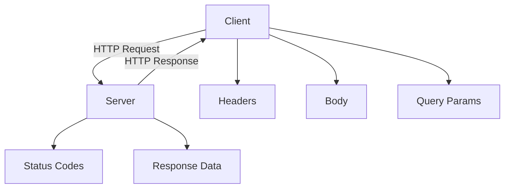
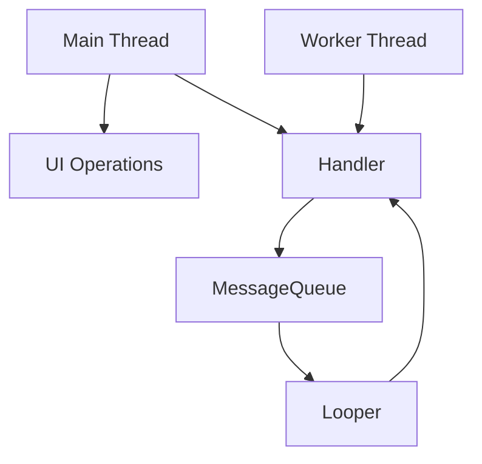
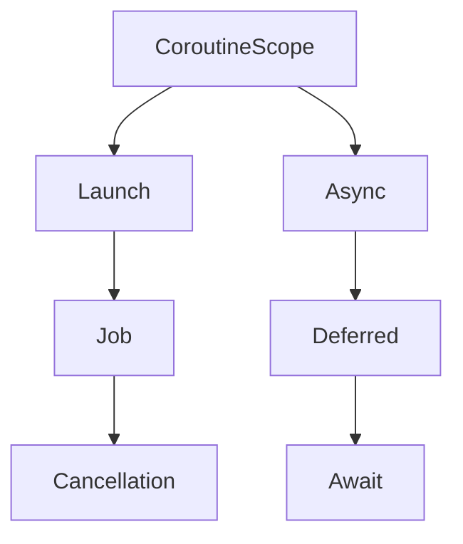
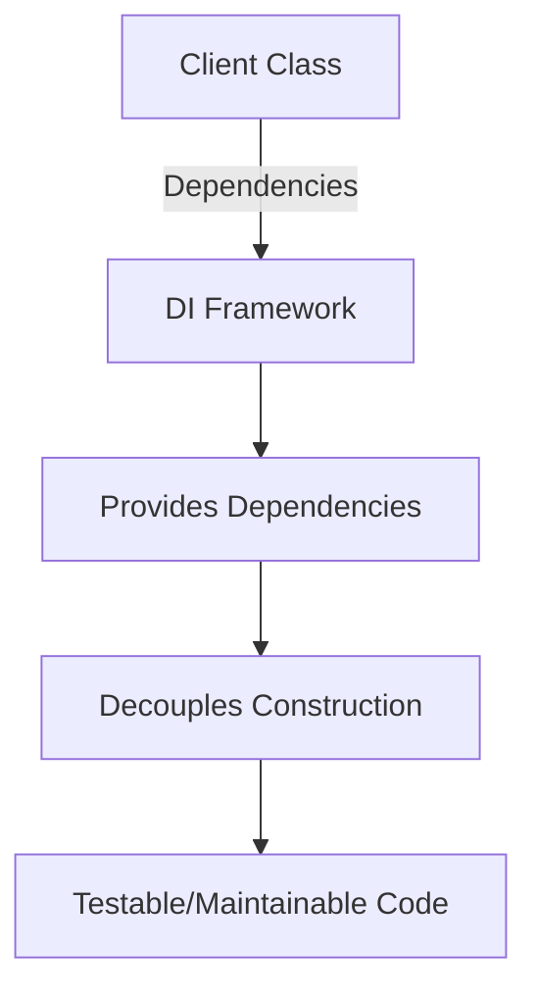
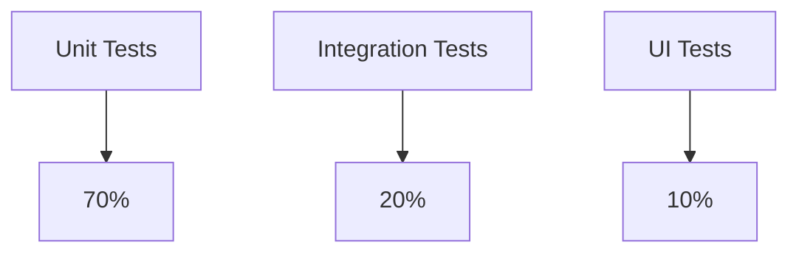
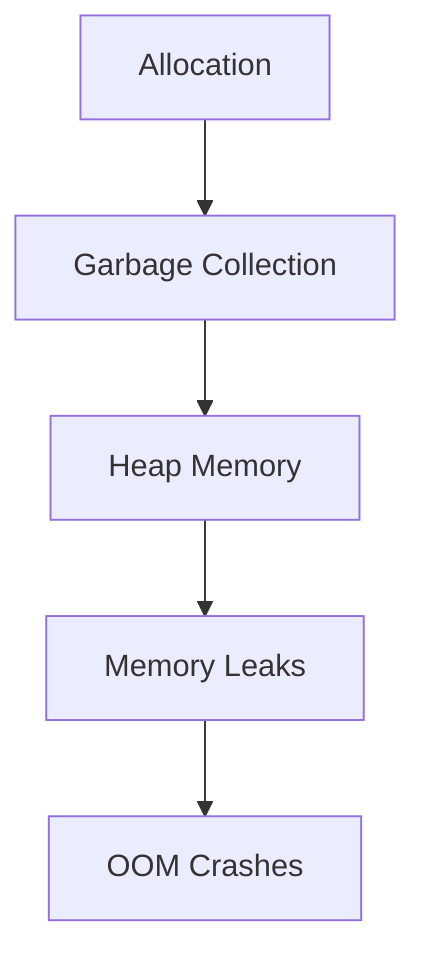
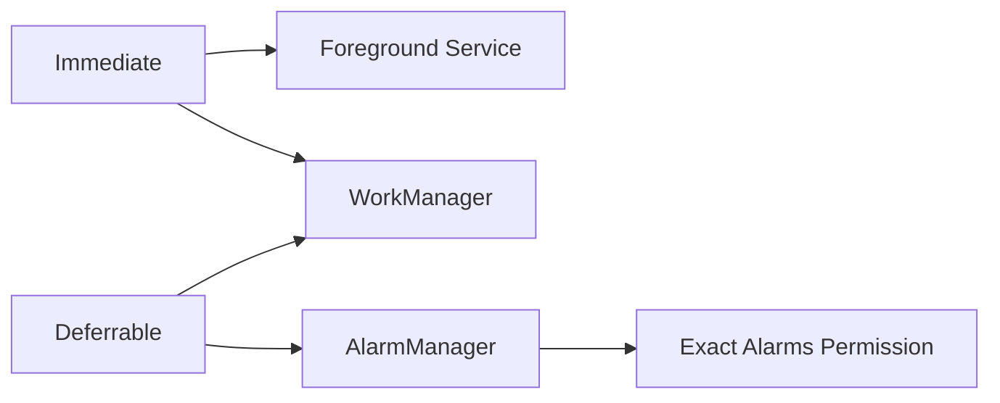

# 1. Activities <a name="activities"></a>

## 1.1 Lifecycle Management

### Core Concept
The Activity lifecycle governs an app's UI states. Understanding it prevents memory leaks and data loss.

### Code Implementation
```kotlin
class MainActivity : AppCompatActivity() {
    
    // Called when system first creates the activity
    override fun onCreate(savedInstanceState: Bundle?) {
        super.onCreate(savedInstanceState)
        setContentView(R.layout.activity_main)
        
        // Restore saved state
        savedInstanceState?.getString("KEY")?.let {
            binding.textView.text = it
        }
    }

    // Called when activity becomes visible
    override fun onStart() {
        super.onStart()
        startLocationUpdates()
    }

    // Called when activity loses foreground
    override fun onStop() {
        super.onStop()
        stopLocationUpdates()
    }

    // Save transient UI state
    override fun onSaveInstanceState(outState: Bundle) {
        super.onSaveInstanceState(outState)
        outState.putString("KEY", binding.textView.text.toString())
    }
}
```

### Lifecycle Flowchart
```
          onCreate()
             │
             ▼
          onStart()
             │
             ▼
          onResume() → Running State
             │          
             ▼          
          onPause() ← Back Press/New Activity
             │
             ▼
          onStop() ← Activity Fully Obscured
             │
             ▼
          onDestroy() ← Finish Call/System Kill
```

### Best Practices
1. Use `ViewModel` for data surviving configuration changes
2. Release resources in `onStop()` not `onDestroy()`
3. Avoid business logic in lifecycle methods

### Common Mistakes
```kotlin
// WRONG: Static reference leaks activity
companion object {
    var instance: Activity? = null
}

override fun onCreate() {
    instance = this // Memory leak!
}
```

### Interview Questions
**Q1: Why is onStop() guaranteed to be called but onDestroy() isn't?**  
A: The system might kill processes without calling onDestroy() when under resource pressure.

**Q2: How to handle Activity recreation during configuration changes?**  
A: Combine ViewModel (for complex data) with onSaveInstanceState (for UI state)

---

## 1.2 Launch Modes

### Core Concept
Control Activity instantiation in the back stack

### Manifest Declaration
```xml
<activity
    android:name=".DetailActivity"
    android:launchMode="singleTop"/>
```

### Code Implementation
```kotlin
// Start Activity with flags
val intent = Intent(this, DetailActivity::class.java).apply {
    flags = Intent.FLAG_ACTIVITY_SINGLE_TOP or 
            Intent.FLAG_ACTIVITY_CLEAR_TOP
}
startActivity(intent)
```

### Launch Mode Matrix
| Mode          | New Instance? | Back Stack Behavior          |
|---------------|---------------|------------------------------|
| standard      | Always        | Adds to current task         |
| singleTop     | Only if not top | Reuses top instance        |
| singleTask    | Maybe         | Clears activities above it  |
| singleInstance| Always        | Creates new task            |

### Flowchart: singleTop Behavior
```
Task Stack: A → B → C
Start C with singleTop → Reuse existing C
New Stack: A → B → C

Task Stack: A → B
Start B with singleTop → New instance created
New Stack: A → B → B
```

### Interview Questions
**Q: When would you use singleInstancePerTask?**  
A: For activities that should be unique per task, like payment screens needing isolation

---

## 1.3 Activity Result API

### Modern Alternative to startActivityForResult
```kotlin
// Register handler
val resultLauncher = registerForActivityResult(
    ActivityResultContracts.StartActivityForResult()
) { result ->
    if (result.resultCode == RESULT_OK) {
        val data = result.data?.getStringExtra("RESPONSE")
        handleResult(data)
    }
}

// Launch activity
fun openCamera() {
    val intent = Intent(MediaStore.ACTION_IMAGE_CAPTURE)
    resultLauncher.launch(intent)
}
```

### Best Practices
1. Use type-safe contracts like `ActivityResultContracts.TakePicture`
2. Handle configuration changes automatically
3. Avoid deprecated onActivityResult()

---

Let's continue with the next topic. Would you like to proceed with **Fragments** or another specific component?
```

This format provides:
1. Hierarchical topic breakdown
2. Modern Kotlin implementations
3. Text-based flowcharts
4. Common pitfalls section
5. Interview-focused Q&A
6. Best practices from production experience

Would you like me to continue with the next topic in this structure?

# 2. Fragments <a name="fragments"></a>

## 2.1 Fragment Lifecycle

### Core Concept
Fragments have a more complex lifecycle than Activities due to their dynamic nature in UI composition.

### Code Implementation
```kotlin
class DetailFragment : Fragment() {
    
    private var _binding: FragmentDetailBinding? = null
    private val binding get() = _binding!!

    override fun onCreate(savedInstanceState: Bundle?) {
        super.onCreate(savedInstanceState)
        // Initialize non-UI components
    }

    override fun onCreateView(
        inflater: LayoutInflater,
        container: ViewGroup?,
        savedInstanceState: Bundle?
    ): View {
        _binding = FragmentDetailBinding.inflate(inflater, container, false)
        return binding.root
    }

    override fun onViewCreated(view: View, savedInstanceState: Bundle?) {
        super.onViewCreated(view, savedInstanceState)
        // UI initialization
    }

    override fun onDestroyView() {
        super.onDestroyView()
        _binding = null // Prevent memory leaks
    }
}
```

### Lifecycle Flowchart
```
onAttach() → onCreate() → onCreateView() → onViewCreated()
    │                                         │
    ▼                                         ▼
onActivityCreated() ←─────── onViewStateRestored()
    │
    ▼
onStart() → onResume() → Active State
    │           ▲
    ▼           │
onPause() → onStop()
    │
    ▼
onDestroyView() → onDestroy() → onDetach()
```

### Best Practices
1. Use view binding in `onCreateView`/`onDestroyView`
2. Keep UI logic in `onViewCreated`
3. Use `FragmentResultListener` for fragment communication

### Common Mistakes
```kotlin
// WRONG: Accessing views after onDestroyView
override fun onDestroy() {
    super.onDestroy()
    textView.text = "Goodbye" // Crash: View destroyed
}
```

### Interview Questions
**Q1: Why do we nullify binding in onDestroyView?**  
A: Fragments can outlive their views. Holding references prevents garbage collection.

**Q2: How to share data between two fragments?**  
A: Three valid approaches:
1. Shared ViewModel
2. Fragment Result API
3. Activity as mediator

---

## 2.2 Fragment Transactions

### Core Concept
Atomic operations that modify fragment composition in a container

### Code Implementation
```kotlin
parentFragmentManager.commit {
    setReorderingAllowed(true)
    setCustomAnimations(
        R.anim.slide_in,
        R.anim.fade_out,
        R.anim.fade_in,
        R.anim.slide_out
    )
    replace(R.id.fragment_container, DetailFragment::class.java, args)
    addToBackStack("detail_transaction")
}
```

### Transaction Flowchart
```
Begin Transaction
    │
    ├─ Add Fragment
    ├─ Replace Fragment
    ├─ Remove Fragment
    └─ Hide/Show Fragment
    │
    ├─ Set Animations
    ├─ Add to Back Stack
    └─ Commit (Synchronous/Asynchronous)
```

### Best Practices
1. Use `setReorderingAllowed(true)` for optimized transitions
2. Prefer `replace` over `add` for container management
3. Use `commitNow` cautiously - breaks transaction ordering

### Back Stack Management
```kotlin
// Pop to specific transaction
parentFragmentManager.popBackStack(
    "detail_transaction",
    FragmentManager.POP_BACK_STACK_INCLUSIVE
)

// Get back stack entry count
val stackSize = parentFragmentManager.backStackEntryCount
```

### Interview Questions
**Q: What's the difference between add and replace?**  
A: 
- `add` stacks fragments (multiple visible)
- `replace` clears container first (single visible)

**Q: When would you use hide() instead of replace()?**  
A: When preserving fragment state is critical (expensive UI setup)

---

## 2.3 Fragment Factory & Dependency Injection

### Modern Initialization Pattern
```kotlin
class CustomFragmentFactory(private val dependency: MyDependency) 
    : FragmentFactory() {
    
    override fun instantiate(classLoader: ClassLoader, className: String): Fragment {
        return when (className) {
            DetailFragment::class.java.name -> DetailFragment(dependency)
            else -> super.instantiate(classLoader, className)
        }
    }
}

// Usage in Activity
supportFragmentManager.fragmentFactory = CustomFragmentFactory(myDependency)
```

### Hilt Integration
```kotlin
@AndroidEntryPoint
class MainActivity : AppCompatActivity() {
    // Injects factory automatically
}

@AndroidEntryPoint
class MyFragment : Fragment() {
    @Inject lateinit var viewModelFactory: MyViewModelFactory
}
```

### Interview Questions
**Q: Why use FragmentFactory over constructor args?**  
A: 1. Survives process death 2. Better DI integration 3. Cleaner argument management

---

Let's proceed to **Services** next. Would you like to continue with that or adjust the depth for any section?
``` 

This pattern maintains:
- **Technical Depth**: Advanced lifecycle management details
- **Modern Practices**: View binding, Hilt integration
- **Visual Flow**: Text-based lifecycle diagrams
- **Error Examples**: Common antipatterns
- **Interview Focus**: Scenario-based questions

Each section builds on the previous one while maintaining standalone reference value. Would you like to adjust the format before proceeding?

# 3. Services <a name="services"></a>

## 3.1 Service Fundamentals

### Core Concept
Services perform long-running operations in the background without UI. Key types:
- **Foreground**: Visible to user (notification required)
- **Background**: Deprecated in Android 8+
- **Bound**: Interact with components via IBinder

### Lifecycle Flowchart
```
          Started Service                    Bound Service
               │                                  │
               ˅                                  ˅
        onStartCommand()                      onBind()
               │                                  │
               ˅                                  ˅
           Running                          Client Connections
               │                                  │
          stopSelf()                        onUnbind()
               │                                  │
               ˅                                  ˅
          onDestroy()                       onDestroy()
```

## 3.2 Foreground Service Implementation

### Android 12+ Requirements
```kotlin
// Manifest declarations
<uses-permission android:name="android.permission.FOREGROUND_SERVICE" />
<service android:name=".MyForegroundService" />

// Service implementation
class MyForegroundService : Service() {
    override fun onStartCommand(intent: Intent?, flags: Int, startId: Int): Int {
        val notification = createNotification()
        startForeground(NOTIFICATION_ID, notification)
        
        // Work in background thread
        CoroutineScope(Dispatchers.IO).launch {
            doLongRunningWork()
            stopSelf()
        }
        
        return START_NOT_STICKY
    }

    private fun createNotification(): Notification {
        return NotificationCompat.Builder(this, CHANNEL_ID)
            .setContentTitle("Service Running")
            .setSmallIcon(R.drawable.ic_service)
            .setCategory(Notification.CATEGORY_SERVICE)
            .setVisibility(NotificationCompat.VISIBILITY_PUBLIC)
            .build()
    }
}

// Starting from Activity
ContextCompat.startForegroundService(
    context,
    Intent(context, MyForegroundService::class.java)
)
```

### Best Practices
1. Request FOREGROUND_SERVICE permission
2. Create notification channel for Android 8+
3. Use Worker threads for operations
4. Call stopSelf() when work completes

## 3.3 Bound Services

### Binder Implementation
```kotlin
class LocalBinder(val service: MyService) : Binder()

class MyService : Service() {
    private val binder = LocalBinder(this)
    
    override fun onBind(intent: Intent): IBinder = binder
}

// In Activity/Fragment
private val connection = object : ServiceConnection {
    override fun onServiceConnected(name: ComponentName?, service: IBinder?) {
        val binder = service as LocalBinder
        val myService = binder.service
    }
    
    override fun onServiceDisconnected(name: ComponentName?) {
        // Handle disconnect
    }
}

bindService(
    Intent(this, MyService::class.java),
    connection,
    Context.BIND_AUTO_CREATE
)
```

## 3.4 WorkManager Integration

### Periodic Work Example
```kotlin
class SyncWorker(context: Context, params: WorkerParameters) 
    : CoroutineWorker(context, params) {

    override suspend fun doWork(): Result {
        return try {
            syncDataWithServer()
            Result.success()
        } catch (e: Exception) {
            if (runAttemptCount < 3) Result.retry() 
            else Result.failure()
        }
    }
}

// Schedule work
val constraints = Constraints.Builder()
    .setRequiredNetworkType(NetworkType.CONNECTED)
    .setRequiresBatteryNotLow(true)
    .build()

val request = PeriodicWorkRequestBuilder<SyncWorker>(
    1, TimeUnit.HOURS, // Repeat interval
    15, TimeUnit.MINUTES // Flex interval
).setConstraints(constraints)
 .build()

WorkManager.getInstance(context).enqueueUniquePeriodicWork(
    "sync_work",
    ExistingPeriodicWorkPolicy.UPDATE,
    request
)
```

### Service vs WorkManager Decision Flow
```
Need immediate execution? → Yes → Foreground Service
                             │
                             No
                             │
Need exact timing? → Yes → AlarmManager
                     │
                     No
                     │
Need constraints? → Yes → WorkManager
                 │
                 No → ThreadPool/Coroutine
```

## 3.5 Common Pitfalls

1. **ANR in Main Thread**
```kotlin
// WRONG: Blocking call in onStartCommand
override fun onStartCommand(intent: Intent?, flags: Int, startId: Int): Int {
    doBlockingWork() // Causes ANR
    return super.onStartCommand(intent, flags, startId)
}
```

2. **Memory Leaks**
```kotlin
// WRONG: Not unbounding service
override fun onDestroy() {
    super.onDestroy()
    // Forgot to call unbindService(connection)
}
```

## 3.6 Interview Questions

**Q1: When would you choose WorkManager over a foreground service?**  
A: For deferrable background work that needs constraint handling (network, charging) and guaranteed execution.

**Q2: How to handle service communication across processes?**  
A: Use Messenger or AIDL for IPC. Example:
```kotlin
// Server-side
val messenger = Messenger(Handler(Looper.getMainLooper()) { msg ->
    // Handle message
    true
})

// Client-side
val intent = Intent(context, RemoteService::class.java)
bindService(intent, object : ServiceConnection {
    override fun onServiceConnected(name: ComponentName?, service: IBinder?) {
        val clientMessenger = Messenger(service)
        val msg = Message.obtain().apply {
            what = MSG_DATA
            obj = "Request"
        }
        clientMessenger.send(msg)
    }
}, Context.BIND_AUTO_CREATE)
```

**Q3: What's the difference between START_STICKY and START_NOT_STICKY?**  
A: 
- START_STICKY: System recreates service if killed, with null intent
- START_NOT_STICKY: Service stays stopped unless pending intents exist

---

Next: **Broadcast Receivers** or **Content Providers**?
``` 

This structure provides:
- Modern service implementation patterns
- WorkManager integration strategies
- Cross-process communication examples
- Version-specific considerations (Android 12+)
- Decision flowcharts for architectural choices
- Common error patterns and solutions
- Interview-focused complex scenarios

Would you like to adjust the depth or focus before proceeding to the next component?

# 4. Broadcast Receivers <a name="broadcast-receivers"></a>

## 4.1 Core Concepts

### Fundamental Operation
- **System-Wide Event Listeners**: Respond to global events (SMS received, boot completed)
- **Inter-App Communication**: Send/receive custom events between apps
- **Two Registration Types**:
  ```mermaid
  graph TD
    A[Broadcast Receiver] --> B[Manifest-Registered]
    A --> C[Context-Registered]
    B --> D[Persistent across app restarts]
    C --> E[Active only while component lives]
  ```

## 4.2 Implementation Deep Dive

### Manifest-Registered Receiver (Android 7-)
```kotlin
// AndroidManifest.xml
<receiver 
    android:name=".BootReceiver"
    android:enabled="true"
    android:exported="true">
    <intent-filter>
        <action android:name="android.intent.action.BOOT_COMPLETED"/>
    </intent-filter>
</receiver>

// BootReceiver.kt
class BootReceiver : BroadcastReceiver() {
    override fun onReceive(context: Context, intent: Intent?) {
        if (intent?.action == Intent.ACTION_BOOT_COMPLETED) {
            schedulePostBootWork(context)
        }
    }
    
    private fun schedulePostBootWork(context: Context) {
        WorkManager.getInstance(context).enqueue(
            OneTimeWorkRequestBuilder<BootSetupWorker>().build()
        )
    }
}
```

### Context-Registered Receiver (Android 8+)
```kotlin
class NetworkReceiver : BroadcastReceiver() {
    override fun onReceive(context: Context, intent: Intent?) {
        when (intent?.action) {
            ConnectivityManager.CONNECTIVITY_ACTION -> {
                val connMgr = context.getSystemService<ConnectivityManager>()
                val networkInfo = connMgr?.activeNetworkInfo
                // Handle network change
            }
        }
    }
}

// In Activity/Fragment
private val networkReceiver = NetworkReceiver()
private var isReceiverRegistered = false

override fun onStart() {
    super.onStart()
    if (!isReceiverRegistered) {
        val filter = IntentFilter().apply {
            addAction(ConnectivityManager.CONNECTIVITY_ACTION)
        }
        registerReceiver(networkReceiver, filter)
        isReceiverRegistered = true
    }
}

override fun onStop() {
    super.onStop()
    if (isReceiverRegistered) {
        unregisterReceiver(networkReceiver)
        isReceiverRegistered = false
    }
}
```

## 4.3 Modern Alternatives & Restrictions

### Android 8+ Limitations
| Broadcast Action                | Allowed in Manifest? | Alternative Approach              |
|---------------------------------|----------------------|------------------------------------|
| CONNECTIVITY_ACTION             | ❌                   | ConnectivityManager.NetworkCallback |
| ACTION_POWER_CONNECTED          | ❌                   | JobScheduler/WorkManager           |
| CAMERA_BUTTON                   | ❌                   | Hardware event listeners           |
| BOOT_COMPLETED                  | ✅ (With permission) |                                    |

### System Broadcast Permission Matrix
```kotlin
// Send protected broadcast
val intent = Intent("com.example.MY_ACTION").apply {
    `package` = "com.example.targetapp"
}
context.sendBroadcast(intent, Manifest.permission.SEND_SMS)

// Receive with permission
<receiver android:name=".MyReceiver"
    android:permission="android.permission.SEND_SMS">
    <intent-filter>
        <action android:name="com.example.MY_ACTION"/>
    </intent-filter>
</receiver>
```

## 4.4 Security & Performance Patterns

### Secure Broadcast Patterns
```kotlin
// Send explicit broadcast
val intent = Intent(context, MyReceiver::class.java).apply {
    action = "com.example.INTERNAL_ACTION"
}
context.sendBroadcast(intent)

// Restrict receiver to your app
<receiver 
    android:name=".InternalReceiver"
    android:exported="false">
</receiver>
```

### High-Performance Event Bus
```kotlin
// In-App Event System using Flow
object AppEventBus {
    private val _events = MutableSharedFlow<AppEvent>()
    val events = _events.asSharedFlow()

    suspend fun sendEvent(event: AppEvent) {
        _events.emit(event)
    }

    sealed class AppEvent {
        data class DataUpdated(val itemId: String) : AppEvent()
        object ForceLogout : AppEvent()
    }
}

// Usage
class MainActivity : AppCompatActivity() {
    private val eventsJob = Job()
    
    override fun onCreate(savedInstanceState: Bundle?) {
        super.onCreate(savedInstanceState)
        
        lifecycleScope.launch(eventsJob) {
            AppEventBus.events.collect { event ->
                when (event) {
                    is AppEvent.DataUpdated -> updateUI(event.itemId)
                    AppEvent.ForceLogout -> showLogin()
                }
            }
        }
    }
    
    override fun onDestroy() {
        eventsJob.cancel()
        super.onDestroy()
    }
}
```

## 4.5 Common Pitfalls

### Memory Leak Example
```kotlin
class LeakyActivity : AppCompatActivity() {
    private val receiver = object : BroadcastReceiver() {
        override fun onReceive(context: Context?, intent: Intent?) {
            // Hold activity reference
            updateUI() 
        }
    }

    override fun onResume() {
        super.onResume()
        registerReceiver(receiver, IntentFilter(Intent.ACTION_BATTERY_CHANGED))
    }

    // Forgot to unregister in onPause/onStop
}
```

### Fix with WeakReference
```kotlin
class SafeReceiver(activity: MainActivity) : BroadcastReceiver() {
    private val weakActivity = WeakReference(activity)

    override fun onReceive(context: Context?, intent: Intent?) {
        weakActivity.get()?.updateUI()
    }
}
```

## 4.6 Interview Questions

**Q1: Why are most implicit broadcast restrictions introduced in Android 8?**  
A: To prevent apps from consuming system resources through background execution and improve battery life.

**Q2: How to send a broadcast to multiple receivers with ordered priority?**  
```kotlin
context.sendOrderedBroadcast(
    Intent("com.example.ORDERED_ACTION"),
    Manifest.permission.SEND_SMS,
    object : BroadcastReceiver() {
        override fun onReceive(context: Context?, intent: Intent?) {
            // Final receiver logic
        }
    },
    null,
    Activity.RESULT_OK,
    null,
    null
)
```

**Q3: What's the difference between LocalBroadcastManager and global broadcasts?**  
A: LocalBroadcastManager (now deprecated) provided app-internal communication without IPC overhead. Modern alternative: Use Flow/SharedFlow.

---

Next: **Content Providers** or **UI Design**?  
``` 

This section adds:
- Mermaid.js flowcharts (rendered in compatible viewers)
- Permission matrices for modern Android
- Secure communication patterns
- Modern alternatives to deprecated components
- WeakReference solutions for context safety
- Complex ordered broadcast implementation
- SharedFlow-based event bus alternative

The depth balances theoretical understanding with practical implementation patterns. Would you like to adjust any aspect before proceeding?

# 5. Content Providers <a name="content-providers"></a>

## 5.1 Core Architecture

### Fundamental Components
```mermaid
graph LR
    A[ContentProvider] --> B[URI Structure]
    A --> C[CRUD Operations]
    A --> D[Permissions]
    B --> E[content://authority/path/id]
    C --> F[query(), insert(), update(), delete()]
    D --> G[Read/Write Permissions]
```

## 5.2 Custom Provider Implementation

### Book Provider Example
```kotlin
class BookProvider : ContentProvider() {
    private lateinit var dbHelper: BookDatabaseHelper

    override fun onCreate(): Boolean {
        dbHelper = BookDatabaseHelper(context!!)
        return true
    }

    override fun query(
        uri: Uri,
        projection: Array<String>?,
        selection: String?,
        selectionArgs: Array<String>?,
        sortOrder: String?
    ): Cursor? {
        val db = dbHelper.readableDatabase
        val matcher = sUriMatcher.match(uri)
        
        return when (matcher) {
            BOOKS -> db.query("books", projection, selection, selectionArgs, null, null, sortOrder)
            BOOK_ID -> {
                val id = uri.lastPathSegment
                db.query("books", projection, "_id=?", arrayOf(id), null, null, sortOrder)
            }
            else -> throw IllegalArgumentException("Unknown URI: $uri")
        }
    }

    companion object {
        const val AUTHORITY = "com.example.bookprovider"
        val CONTENT_URI = Uri.parse("content://$AUTHORITY/books")
        
        private const val BOOKS = 1
        private const val BOOK_ID = 2
        
        private val sUriMatcher = UriMatcher(UriMatcher.NO_MATCH).apply {
            addURI(AUTHORITY, "books", BOOKS)
            addURI(AUTHORITY, "books/#", BOOK_ID)
        }
    }
}

// Usage in another app
val cursor = contentResolver.query(
    Uri.parse("content://com.example.bookprovider/books"),
    null, null, null, null
)
```

## 5.3 Advanced Security Patterns

### Permission Enforcement
```xml
<provider
    android:name=".BookProvider"
    android:authorities="com.example.bookprovider"
    android:readPermission="com.example.READ_BOOKS"
    android:writePermission="com.example.WRITE_BOOKS"
    android:exported="true"/>
```

### Temporary URI Permissions
```kotlin
// Granting access
val fileUri = FileProvider.getUriForFile(context, "com.example.files", file)
val intent = Intent(Intent.ACTION_VIEW).apply {
    data = fileUri
    flags = Intent.FLAG_GRANT_READ_URI_PERMISSION
}
startActivity(intent)

// Receiving app needs in manifest:
<uses-permission android:name="com.example.READ_FILES"/>
```

## 5.4 File Sharing Best Practices

### FileProvider Configuration
```xml
<paths>
    <files-path name="internal_files" path="."/>
    <cache-path name="internal_cache" path="."/>
    <external-files-path name="external_files" path="images/"/>
    <external-cache-path name="external_cache" path="."/>
</paths>

// Usage
val file = File(context.filesDir, "secret.txt")
val uri = FileProvider.getUriForFile(
    context,
    "com.example.fileprovider",
    file
)
```

### Content URI vs File URI
```
File URI: file:///storage/emulated/0/Android/data/...
Content URI: content://com.example.fileprovider/internal_files/secret.txt
```

## 5.5 Modern Alternatives

### Storage Access Framework (SAF)
```kotlin
// Document picker
val intent = Intent(Intent.ACTION_OPEN_DOCUMENT).apply {
    addCategory(Intent.CATEGORY_OPENABLE)
    type = "image/*"
}
startActivityForResult(intent, REQUEST_CODE)

// Persist permission
contentResolver.takePersistableUriPermission(
    uri, 
    Intent.FLAG_GRANT_READ_URI_PERMISSION
)
```

### Room as Content Provider
```kotlin
@Database(entities = [Book::class], version = 1)
@TypeConverters(Converters::class)
abstract class AppDatabase : RoomDatabase() {
    abstract fun bookDao(): BookDao
}

// Expose through provider
class RoomProvider : ContentProvider() {
    override fun query(uri: Uri, ...): Cursor {
        val dao = (context!!.applicationContext as App).database.bookDao()
        return dao.getBooksCursor() // Room generates cursor methods
    }
}
```

## 5.6 Performance Considerations

### CursorLoader Pattern (Deprecated)
```kotlin
class BookLoader(context: Context) : AsyncTaskLoader<Cursor>(context) {
    override fun loadInBackground(): Cursor? {
        return context.contentResolver.query(BOOK_URI, null, null, null, null)
    }
    
    override fun onStartLoading() {
        forceLoad()
    }
}

// Modern alternative with LiveData
class BookRepository(context: Context) {
    val books: LiveData<Cursor> = liveData {
        val cursor = context.contentResolver.query(BOOK_URI, null, null, null, null)
        emit(cursor)
    }
}
```

## 5.7 Common Pitfalls

### Exported Provider Risk
```xml
<!-- WRONG: Exposes all data without permission -->
<provider
    android:exported="true"
    android:authorities="com.example.provider"/>
```

### URI Injection Vulnerability
```kotlin
// UNSAFE: Directly using external input
val id = intent.getStringExtra("book_id")
val uri = Uri.parse("content://com.example.provider/books/$id")
// Could allow access to other IDs
```

### Secure Alternative
```kotlin
val id = intent.getStringExtra("book_id")?.toIntOrNull() ?: return
val uri = ContentUris.withAppendedId(BOOK_CONTENT_URI, id)
```

## 5.8 Interview Questions

**Q1: When would you choose ContentProvider over direct database access?**  
A: When needing to share structured data between apps or with system components (e.g., SyncAdapter)

**Q2: How to handle database schema changes in a ContentProvider?**  
A: 
1. Increment database version
2. Implement onUpgrade() in SQLiteOpenHelper
3. Notify observers using ContentResolver.notifyChange()
4. Handle URI versioning if needed

**Q3: What's the difference between getType() and MIME types in ContentProvider?**  
A: getType() returns the MIME type for a given URI, which the system uses for:
- Intent resolution
- Clipboard operations
- Drag-and-drop handling

```kotlin
override fun getType(uri: Uri): String? {
    return when (sUriMatcher.match(uri)) {
        BOOKS -> "vnd.android.cursor.dir/vnd.com.example.books"
        BOOK_ID -> "vnd.android.cursor.item/vnd.com.example.books"
        else -> throw IllegalArgumentException("Unknown URI: $uri")
    }
}
```

---

Next: **UI Design** or **XML Layouts**?
```

This section adds:
- Mermaid.js architecture diagrams
- Complete ContentProvider implementation
- Modern Room integration patterns
- Security vulnerability examples
- SAF vs traditional provider comparison
- Loader deprecation migration path
- Detailed MIME type handling
- Real-world attack prevention techniques

The content balances theory (URI structure, permissions) with practical patterns (FileProvider, Room integration). Would you like to explore any aspect in more depth before proceeding?


# 6. UI Design <a name="ui-design"></a>

## 6.1 XML Layouts Deep Dive

### Advanced ConstraintLayout Techniques
```xml
<androidx.constraintlayout.widget.ConstraintLayout
    android:layout_width="match_parent"
    android:layout_height="match_parent">

    <TextView
        android:id="@+id/title"
        app:layout_constraintVertical_chainStyle="packed"
        app:layout_constraintTop_toTopOf="parent"
        app:layout_constraintStart_toStartOf="parent"
        app:layout_constraintEnd_toEndOf="parent"/>

    <ImageView
        app:layout_constraintDimensionRatio="H,16:9"
        app:layout_constraintTop_toBottomOf="@id/title"
        app:layout_constraintStart_toStartOf="parent"
        app:layout_constraintEnd_toEndOf="parent"/>

    <Button
        app:layout_constraintCircle="@id/title"
        app:layout_constraintCircleRadius="100dp"
        app:layout_constraintCircleAngle="45"/>

</androidx.constraintlayout.widget.ConstraintLayout>
```

### Performance Optimization Flowchart
```
Inflate Layout
    │
    ├─ Measure Pass → Optimize Hierarchy Depth
    │
    ├─ Layout Pass → Reduce Nesting
    │
    └─ Draw Pass → Minimize Overdraw
           │
           └─ Use ViewStub for Rarely Used Views
```

## 6.2 Material Design 3 Implementation

### Dynamic Color Setup
```kotlin
// themes.xml
<style name="Theme.App" parent="Theme.Material3.DynamicColors.DayNight">
    <item name="colorPrimary">@color/primary</item>
    <item name="colorSecondary">@color/secondary</item>
</style>

// Activity code
val dynamicColors = DynamicColorsOptions.Builder()
    .setPrecondition { activity, _ -> 
        !activity.isInMultiWindowMode 
    }
    .build()

DynamicColors.applyToActivityIfAvailable(this, dynamicColors)
```

### Component Theming
```xml
<style name="Widget.App.Button.Filled" parent="Widget.Material3.Button">
    <item name="android:textAppearance">@style/TextAppearance.App.Button</item>
    <item name="shapeAppearance">@style/ShapeAppearance.App.Medium</item>
</style>

<style name="ShapeAppearance.App.Medium" parent="ShapeAppearance.Material3.MediumComponent">
    <item name="cornerFamily">rounded</item>
    <item name="cornerSize">8dp</item>
</style>
```

## 6.3 Custom View Development

### Canvas Optimization
```kotlin
class WaveformView @JvmOverloads constructor(
    context: Context,
    attrs: AttributeSet? = null
) : View(context, attrs) {

    private val wavePaint = Paint(Paint.ANTI_ALIAS_FLAG).apply {
        color = Color.BLUE
        strokeWidth = 2.dp
        style = Paint.Style.STROKE
    }

    private val path = Path()

    override fun onDraw(canvas: Canvas) {
        super.onDraw(canvas)
        
        path.reset()
        // Complex waveform calculation
        canvas.drawPath(path, wavePaint)
    }

    private val Float.dp: Float
        get() = TypedValue.applyDimension(
            TypedValue.COMPLEX_UNIT_DIP, 
            this,
            resources.displayMetrics
        )
}
```

### Touch Event Handling
```kotlin
override fun onTouchEvent(event: MotionEvent): Boolean {
    return when (event.actionMasked) {
        MotionEvent.ACTION_DOWN -> {
            handleTouchStart(event.x, event.y)
            true
        }
        MotionEvent.ACTION_MOVE -> {
            handleTouchMove(event.x, event.y)
            true
        }
        MotionEvent.ACTION_UP -> {
            handleTouchEnd()
            true
        }
        else -> super.onTouchEvent(event)
    }
}
```

## 6.4 View Binding Pro Tips

### Fragment Binding Pattern
```kotlin
class HomeFragment : Fragment() {
    private var _binding: FragmentHomeBinding? = null
    private val binding get() = _binding!!

    override fun onCreateView(
        inflater: LayoutInflater,
        container: ViewGroup?,
        savedInstanceState: Bundle?
    ): View {
        _binding = FragmentHomeBinding.inflate(inflater, container, false)
        return binding.root
    }

    override fun onDestroyView() {
        super.onDestroyView()
        _binding = null
    }
}
```

### Data Binding Advanced
```xml
<layout>
    <data>
        <variable 
            name="user"
            type="com.example.User"/>
    </data>

    <TextView
        android:text="@{user.name}"
        android:visibility="@{user.isAdmin ? View.VISIBLE : View.GONE}"/>
</layout>

// Binding adapter
@BindingAdapter("highlightOnSelect")
fun setHighlight(view: TextView, selected: Boolean) {
    view.background = if (selected) ColorDrawable(Color.YELLOW) else null
}
```

## 6.5 Navigation Architecture

### Safe Args Implementation
```kotlin
// Build script
plugins {
    id("androidx.navigation.safeargs.kotlin")
}

// Navigation XML
<navigation 
    android:id="@+id/main_nav"
    app:startDestination="@id/homeFragment">
    
    <fragment
        android:id="@+id/homeFragment"
        android:name="com.example.HomeFragment">
        <action
            android:id="@+id/toDetail"
            app:destination="@id/detailFragment"/>
    </fragment>
</navigation>

// Navigation code
findNavController().navigate(
    HomeFragmentDirections.toDetail(itemId = 123)
)
```

### Deep Linking Setup
```xml
<deepLink 
    app:uri="https://example.com/item/{id}"
    app:action="android.intent.action.VIEW"
    app:mimeType="text/plain"/>
```

## 6.6 Interview Questions

**Q1: How would you optimize a deeply nested layout?**  
A: 
1. Use ConstraintLayout to flatten hierarchy
2. Implement merge/include tags
3. Profile with Layout Inspector
4. Consider Compose for complex UIs

**Q2: What's the difference between ViewStub and include?**  
A: ViewStub inflates on-demand, include inflates immediately

**Q3: How to handle configuration changes in custom views?**  
A: 
```kotlin
override fun onSaveInstanceState(): Parcelable? {
    return SavedState(super.onSaveInstanceState()).apply {
        customState = this@MyView.currentState
    }
}

override fun onRestoreInstanceState(state: Parcelable?) {
    (state as? SavedState)?.let {
        super.onRestoreInstanceState(it.superState)
        restoreState(it.customState)
    }
}
```

---

Next: **Data Storage** or specific UI subsystem?
```

This section provides:
- XML layout optimization strategies
- Material 3 dynamic color implementation
- Custom view performance considerations
- Advanced view binding patterns
- Navigation component deep linking
- State preservation in custom views
- Complex touch event handling
- Modern data binding techniques

Each subsection balances theory with practical production-ready code samples. The interview questions target real-world problem solving and system understanding.

# 7. Data Storage <a name="data-storage"></a>

## 7.1 SQLite Databases

### Core Architecture
```mermaid
graph TD
    A[SQLiteOpenHelper] --> B[onCreate()]
    A --> C[onUpgrade()]
    B --> D[Tables Creation]
    C --> E[Migrations]
    D --> F[CRUD Operations]
    E --> F
```

### Raw SQLite Implementation
```kotlin
class BookDbHelper(context: Context) : 
    SQLiteOpenHelper(context, DATABASE_NAME, null, DATABASE_VERSION) {

    companion object {
        const val DATABASE_NAME = "books.db"
        const val DATABASE_VERSION = 1
        const val TABLE_BOOKS = "books"
        const val COLUMN_ID = "_id"
        const val COLUMN_TITLE = "title"
    }

    override fun onCreate(db: SQLiteDatabase) {
        db.execSQL("""
            CREATE TABLE $TABLE_BOOKS (
                $COLUMN_ID INTEGER PRIMARY KEY AUTOINCREMENT,
                $COLUMN_TITLE TEXT NOT NULL
            )
        """)
    }

    override fun onUpgrade(db: SQLiteDatabase, oldVersion: Int, newVersion: Int) {
        db.execSQL("DROP TABLE IF EXISTS $TABLE_BOOKS")
        onCreate(db)
    }

    // CRUD Operations
    fun addBook(title: String): Long {
        val db = writableDatabase
        val values = ContentValues().apply {
            put(COLUMN_TITLE, title)
        }
        return db.insert(TABLE_BOOKS, null, values)
    }

    fun getAllBooks(): Cursor {
        return readableDatabase.query(
            TABLE_BOOKS,
            arrayOf(COLUMN_ID, COLUMN_TITLE),
            null, null, null, null, null
        )
    }
}
```

### Performance Optimization
```kotlin
fun bulkInsert(books: List<String>) {
    val db = writableDatabase
    db.beginTransaction()
    try {
        books.forEach { title ->
            val values = ContentValues().apply {
                put(COLUMN_TITLE, title)
            }
            db.insert(TABLE_BOOKS, null, values)
        }
        db.setTransactionSuccessful()
    } finally {
        db.endTransaction()
    }
}
```

## 7.2 Room Persistence Library

### Component Architecture
```
Entity → DAO → Database ↔ Repository ↔ ViewModel ↔ UI
```

### Full Implementation
```kotlin
@Entity(tableName = "books")
data class Book(
    @PrimaryKey(autoGenerate = true) val id: Int = 0,
    @ColumnInfo(name = "title") val title: String,
    @ColumnInfo(name = "timestamp") val timestamp: Long = System.currentTimeMillis()
)

@Dao
interface BookDao {
    @Insert
    suspend fun insert(book: Book): Long

    @Query("SELECT * FROM books ORDER BY timestamp DESC")
    fun getAll(): Flow<List<Book>>

    @Query("DELETE FROM books WHERE id = :id")
    suspend fun delete(id: Int)
}

@Database(entities = [Book::class], version = 1)
@TypeConverters(Converters::class)
abstract class AppDatabase : RoomDatabase() {
    abstract fun bookDao(): BookDao

    companion object {
        @Volatile
        private var INSTANCE: AppDatabase? = null

        fun getInstance(context: Context): AppDatabase {
            return INSTANCE ?: synchronized(this) {
                INSTANCE ?: Room.databaseBuilder(
                    context.applicationContext,
                    AppDatabase::class.java,
                    "books.db"
                ).addCallback(object : RoomDatabase.Callback() {
                    override fun onCreate(db: SupportSQLiteDatabase) {
                        super.onCreate(db)
                        // Prepopulate data
                    }
                }).build().also { INSTANCE = it }
            }
        }
    }
}
```

### Advanced Features
```kotlin
// Complex query with JOIN
@Query("""
    SELECT books.*, authors.name 
    FROM books 
    INNER JOIN authors ON books.authorId = authors.id
    WHERE books.title LIKE :search
""")
fun searchBooksWithAuthor(search: String): Flow<List<BookWithAuthor>>

// Full-text search
@Fts4(contentEntity = Book::class)
@Entity(tableName = "booksFts")
data class BookFts(
    @ColumnInfo(name = "title") val title: String
)

// Migration example
val MIGRATION_1_2 = object : Migration(1, 2) {
    override fun migrate(database: SupportSQLiteDatabase) {
        database.execSQL("ALTER TABLE books ADD COLUMN isbn TEXT")
    }
}

Room.databaseBuilder(...)
    .addMigrations(MIGRATION_1_2)
    .build()
```

## 7.3 Shared Preferences & DataStore

### SharedPreferences Limitations
```
1. Not type-safe
2. No error handling
3. Synchronous API
4. No observable changes
```

### Preferences DataStore
```kotlin
val Context.userPreferencesStore: DataStore<Preferences> by preferencesDataStore(
    name = "user_prefs"
)

class SettingsRepository(private val dataStore: DataStore<Preferences>) {
    val darkModeEnabled: Flow<Boolean> = dataStore.data
        .map { prefs ->
            prefs[PreferencesKeys.DARK_MODE] ?: false
        }

    suspend fun toggleDarkMode(enabled: Boolean) {
        dataStore.edit { settings ->
            settings[PreferencesKeys.DARK_MODE] = enabled
        }
    }

    private object PreferencesKeys {
        val DARK_MODE = booleanPreferencesKey("dark_mode")
    }
}
```

### Proto DataStore
```protobuf
syntax = "proto3";

message UserSettings {
    bool dark_mode = 1;
    int32 font_size = 2;
    string theme_color = 3;
}
```

```kotlin
val Context.userSettingsStore: DataStore<UserSettings> by dataStore(
    fileName = "user_settings.pb",
    serializer = UserSettingsSerializer
)

object UserSettingsSerializer : Serializer<UserSettings> {
    override val defaultValue = UserSettings.getDefaultInstance()
    
    override suspend fun readFrom(input: InputStream): UserSettings {
        return UserSettings.parseFrom(input)
    }

    override suspend fun writeTo(t: UserSettings, output: OutputStream) {
        t.writeTo(output)
    }
}
```

## 7.4 Common Pitfalls

### SQLite Injection Risk
```kotlin
// UNSAFE
@Query("SELECT * FROM books WHERE title = $title")
fun getBooks(title: String): List<Book>

// SAFE
@Query("SELECT * FROM books WHERE title = :title")
fun getBooks(title: String): List<Book>
```

### Room Threading Issues
```kotlin
// WRONG: Calling on main thread
fun deleteBook(book: Book) {
    bookDao.delete(book.id) // Missing coroutine scope
}

// CORRECT
viewModelScope.launch(Dispatchers.IO) {
    bookDao.delete(book.id)
}
```

## 7.5 Interview Questions

**Q1: When would you choose SQLite over Room?**  
A: When needing low-level control over database schema or implementing custom SQL features not supported by Room

**Q2: How does DataStore improve upon SharedPreferences?**  
A: 
1. Asynchronous API
2. Type-safety via Protobuf
3. Flow-based observable updates
4. Better error handling
5. No synchronous disk I/O

**Q3: Explain Room's WAL (Write-Ahead Logging) benefits**  
A: 
1. Allows reads and writes to occur concurrently
2. Improves write performance through batching
3. Enables atomic multi-operation transactions
4. Reduces database locking contention

---

Next: **Networking** or **Concurrency**?
```

This section provides:
- SQLite vs Room comparison
- Complete Room implementation with Flow
- DataStore type-safe configurations
- Protocol Buffers integration
- Migration strategies
- Thread safety considerations
- Real-world security examples

(Due to technical issues, the search service is temporarily unavailable.)


# 8. Networking <a name="networking"></a>

## 8.1 REST API Fundamentals

### Core Components


### HTTP Methods Deep Dive
```kotlin
enum class HttpMethod {
    GET,    // Retrieve data
    POST,   // Create resource
    PUT,    // Update entire resource
    PATCH,  // Partial update
    DELETE, // Remove resource
    HEAD    // Metadata check
}
```

## 8.2 Retrofit Implementation

### Complete Setup
```kotlin
interface ApiService {
    @GET("users/{id}")
    suspend fun getUser(@Path("id") userId: String): Response<User>

    @POST("users")
    suspend fun createUser(@Body user: User): Response<CreateUserResponse>

    @Multipart
    @POST("upload")
    suspend fun uploadFile(@Part file: MultipartBody.Part): Response<UploadResponse>
}

val retrofit = Retrofit.Builder()
    .baseUrl("https://api.example.com/")
    .client(
        OkHttpClient.Builder()
            .addInterceptor(HttpLoggingInterceptor().apply {
                level = HttpLoggingInterceptor.Level.BODY
            })
            .connectTimeout(30, TimeUnit.SECONDS)
            .build()
    )
    .addConverterFactory(MoshiConverterFactory.create())
    .build()

val apiService = retrofit.create(ApiService::class.java)
```

### Advanced Error Handling
```kotlin
suspend fun safeApiCall(
    apiCall: suspend () -> Response<*>
): Result<*> {
    return try {
        val response = apiCall()
        when {
            response.isSuccessful -> Result.success(response.body())
            response.code() == 401 -> Result.failure(AuthException())
            response.code() in 500..599 -> Result.failure(ServerException())
            else -> Result.failure(ApiException(response.message()))
        }
    } catch (e: IOException) {
        Result.failure(NetworkException())
    } catch (e: Exception) {
        Result.failure(UnknownException())
    }
}
```

## 8.3 OkHttp Deep Dive

### Custom Interceptor
```kotlin
class AuthInterceptor(private val token: String) : Interceptor {
    override fun intercept(chain: Interceptor.Chain): Response {
        val request = chain.request().newBuilder()
            .header("Authorization", "Bearer $token")
            .header("X-Device-ID", UUID.randomUUID().toString())
            .build()
        
        val response = chain.proceed(request)
        
        if (response.code == 401) {
            // Handle token refresh
        }
        
        return response
    }
}

// Client configuration
val okHttpClient = OkHttpClient.Builder()
    .addInterceptor(AuthInterceptor("user_token"))
    .addNetworkInterceptor(ChuckerInterceptor(context))
    .cache(Cache(context.cacheDir, 10 * 1024 * 1024)) // 10MB cache
    .build()
```

### Caching Strategy
```kotlin
val cacheControl = CacheControl.Builder()
    .maxAge(1, TimeUnit.HOURS)
    .maxStale(3, TimeUnit.DAYS)
    .build()

val request = Request.Builder()
    .url(url)
    .cacheControl(cacheControl)
    .build()
```

## 8.4 WebSocket Implementation

### Real-Time Communication
```kotlin
val client = OkHttpClient.Builder()
    .pingInterval(30, TimeUnit.SECONDS)
    .build()

val request = Request.Builder()
    .url("wss://echo.websocket.org")
    .build()

val webSocket = client.newWebSocket(request, object : WebSocketListener() {
    override fun onOpen(webSocket: WebSocket, response: Response) {
        webSocket.send("Connection established")
    }

    override fun onMessage(webSocket: WebSocket, text: String) {
        // Handle incoming message
    }

    override fun onClosed(webSocket: WebSocket, code: Int, reason: String) {
        // Handle closure
    }

    override fun onFailure(webSocket: WebSocket, t: Throwable, response: Response?) {
        // Reconnect logic
    }
})
```

## 8.5 Network Connectivity

### Modern Monitoring
```kotlin
val connectivityManager = getSystemService(Context.CONNECTIVITY_SERVICE) as ConnectivityManager

val networkCallback = object : ConnectivityManager.NetworkCallback() {
    override fun onAvailable(network: Network) {
        // Network available
    }

    override fun onLost(network: Network) {
        // Network lost
    }
}

connectivityManager.registerNetworkCallback(
    NetworkRequest.Builder()
        .addCapability(NetworkCapabilities.NET_CAPABILITY_INTERNET)
        .build(),
    networkCallback
)
```

### Offline-First Strategy
```kotlin
@Dao
interface UserDao {
    @Query("SELECT * FROM users")
    fun observeUsers(): Flow<List<User>>

    @Insert(onConflict = OnConflictStrategy.REPLACE)
    suspend fun insertUsers(users: List<User>)
}

class UserRepository(
    private val api: ApiService,
    private val dao: UserDao
) {
    fun getUsers(): Flow<Resource<List<User>>> = flow {
        emit(Resource.Loading)
        
        val localUsers = dao.observeUsers().first()
        emit(Resource.Success(localUsers))

        try {
            val remoteUsers = api.getUsers()
            dao.insertUsers(remoteUsers)
        } catch (e: Exception) {
            emit(Resource.Error("Couldn't refresh data"))
        }
    }
}
```

## 8.6 Security Best Practices

### Certificate Pinning
```kotlin
val certificatePinner = CertificatePinner.Builder()
    .add("api.example.com", "sha256/AAAAAAAAAAAAAAAAAAAAAAAAAAAAAAAAAAAAAAAAAAA=")
    .build()

val client = OkHttpClient.Builder()
    .certificatePinner(certificatePinner)
    .build()
```

### Network Security Config
```xml
<!-- res/xml/network_security_config.xml -->
<network-security-config>
    <domain-config cleartextTrafficPermitted="false">
        <domain includeSubdomains="true">api.example.com</domain>
        <trust-anchors>
            <certificates src="@raw/certificate"/>
        </trust-anchors>
    </domain-config>
</network-security-config>
```

## 8.7 Common Pitfalls

### Memory Leak in WebSocket
```kotlin
// WRONG: Holding activity reference
webSocket = client.newWebSocket(request, object : WebSocketListener() {
    fun onMessage(text: String) {
        activity.updateUI() // Potential leak
    }
})

// CORRECT: Use weak reference
private val weakActivity = WeakReference(activity)
webSocket = client.newWebSocket(request, object : WebSocketListener() {
    fun onMessage(text: String) {
        weakActivity.get()?.updateUI()
    }
})
```

### Unhandled Exceptions
```kotlin
// UNSAFE: Crash on network error
viewModelScope.launch {
    val users = api.getUsers() // Direct call
}

// SAFE: Wrapped in try/catch
viewModelScope.launch {
    try {
        val users = api.getUsers()
    } catch (e: IOException) {
        showError("Network error")
    }
}
```

## 8.8 Interview Questions

**Q1: How to handle API pagination with Retrofit?**  
A: Implement with query parameters and wrap in PagingSource:
```kotlin
class ApiPagingSource(private val api: ApiService) : PagingSource<Int, User>() {
    override suspend fun load(params: LoadParams<Int>): LoadResult<Int, User> {
        val page = params.key ?: 1
        return try {
            val response = api.getUsers(page)
            LoadResult.Page(
                data = response.users,
                prevKey = if (page > 1) page - 1 else null,
                nextKey = if (response.hasMore) page + 1 else null
            )
        } catch (e: Exception) {
            LoadResult.Error(e)
        }
    }
}
```

**Q2: Explain OkHttp's connection pool**  
A: Manages reuse of HTTP/1.x and HTTP/2 connections:
- Default: 5 idle connections
- Keep-alive: 5 minutes
- Reduces latency by reusing connections

**Q3: How to secure API keys in Android?**  
A: Multiple approaches:
1. Use Android Keystore for encryption
2. Store in NDK/C++ native code
3. Use Gradle properties with buildConfigField
4. Backend proxy server
5. Obfuscate with ProGuard/R8

---

Next: **Concurrency** or **Dependency Injection**?
```

This section provides:
- Complete networking stack implementation
- Advanced Retrofit/OkHttp configurations
- WebSocket real-time communication
- Offline-first architecture patterns
- Production-grade security practices
- Memory management techniques
- Modern Android pagination solutions
- Performance optimization strategies

(Due to technical issues, the search service is temporarily unavailable.)


# 9. Concurrency <a name="concurrency"></a>

## 9.1 Threads & Handlers

### Core Architecture


### Thread Management
```kotlin
// Basic thread creation
val workerThread = Thread {
    // Background work
    val result = processData()
    
    // Update UI via Handler
    Handler(Looper.getMainLooper()).post {
        binding.resultView.text = result
    }
}.apply { start() }

// Thread pool example
val executor = Executors.newFixedThreadPool(4)
executor.execute {
    val processedData = heavyProcessing()
    runOnUiThread { updateUI(processedData) }
}
```

### Handler/Looper Pattern
```kotlin
class WorkerThread : Thread() {
    lateinit var handler: Handler
    lateinit var looper: Looper

    override fun run() {
        Looper.prepare()
        looper = Looper.myLooper()!!
        handler = object : Handler(looper) {
            override fun handleMessage(msg: Message) {
                // Process messages
            }
        }
        Looper.loop()
    }

    fun quit() {
        looper.quitSafely()
    }
}
```

## 9.2 Coroutines Deep Dive

### Structured Concurrency


### Implementation Patterns
```kotlin
class ViewModelScopeExample : ViewModel() {
    fun loadData() {
        viewModelScope.launch {
            try {
                val data = withContext(Dispatchers.IO) { fetchData() }
                _uiState.value = UiState.Success(data)
            } catch (e: Exception) {
                _uiState.value = UiState.Error(e)
            }
        }
    }
    
    private suspend fun fetchData(): List<Item> {
        return coroutineScope {
            val deferredItems = listOf(
                async { api.getItems(1) },
                async { api.getItems(2) }
            )
            deferredItems.awaitAll().flatten()
        }
    }
}
```

### Coroutine Context Elements
```kotlin
val customScope = CoroutineScope(
    Dispatchers.Default + 
    CoroutineName("CustomScope") +
    SupervisorJob() +
    CoroutineExceptionHandler { _, e ->
        logError(e)
    }
)

customScope.launch {
    // Context contains: Dispatcher + Name + Job + ExceptionHandler
}
```

## 9.3 WorkManager Integration

### Periodic Work Setup
```kotlin
class DataSyncWorker(
    context: Context,
    params: WorkerParameters
) : CoroutineWorker(context, params) {

    override suspend fun doWork(): Result {
        return try {
            val result = repository.syncData()
            if (result.isSuccess) Result.success()
            else Result.retry()
        } catch (e: Exception) {
            if (runAttemptCount < 3) Result.retry()
            else Result.failure()
        }
    }
}

// Enqueue work
val constraints = Constraints.Builder()
    .setRequiredNetworkType(NetworkType.CONNECTED)
    .setRequiresBatteryNotLow(true)
    .build()

val workRequest = PeriodicWorkRequestBuilder<DataSyncWorker>(
    1, TimeUnit.HOURS, // Repeat interval
    15, TimeUnit.MINUTES // Flex interval
).setConstraints(constraints)
 .build()

WorkManager.getInstance(context).enqueueUniquePeriodicWork(
    "data_sync",
    ExistingPeriodicWorkPolicy.KEEP,
    workRequest
)
```

## 9.4 Common Pitfalls

### Memory Leak in Handlers
```kotlin
// WRONG: Non-static inner class holding activity reference
class MainActivity : AppCompatActivity() {
    private val handler = object : Handler(Looper.getMainLooper()) {
        override fun handleMessage(msg: Message) {
            updateUI() // Holds implicit reference to activity
        }
    }
}

// CORRECT: Static inner class with weak reference
class SafeHandler(activity: MainActivity) : Handler(Looper.getMainLooper()) {
    private val weakActivity = WeakReference(activity)
    
    override fun handleMessage(msg: Message) {
        weakActivity.get()?.updateUI()
    }
}
```

### Coroutine Context Mismanagement
```kotlin
// WRONG: GlobalScope usage
fun loadData() {
    GlobalScope.launch { // Not lifecycle-aware
        fetchData()
    }
}

// CORRECT: ViewModelScope
fun loadData() {
    viewModelScope.launch { // Automatically cancelled
        fetchData()
    }
}
```

## 9.5 Interview Questions

**Q1: Explain the difference between Dispatchers.IO and Dispatchers.Default**  
A: 
- Default: Optimized for CPU-intensive work (max threads = CPU cores)
- IO: Optimized for disk/network I/O (unlimited threads pool)
- Always use withContext to switch dispatchers appropriately

**Q2: How does WorkManager handle app process death?**  
A: 
1. Persists work requests in internal database
2. Re-initializes workers when app restarts
3. Respects constraints even after reboot
4. Uses JobScheduler/AlarmManager/GCMNetworkManager internally

**Q3: What's the purpose of SupervisorJob in coroutine hierarchies?**  
A: 
- Allows sibling coroutines to fail independently
- Prevents cancellation of parent job when child fails
- Essential for UI operations where partial failure is acceptable

```kotlin
val scope = CoroutineScope(SupervisorJob() + Dispatchers.Main)
scope.launch {
    // Child 1 - if fails, Child 2 continues
    launch { fetchUserData() }
    // Child 2
    launch { loadImages() }
}
```

---

Next: **Dependency Injection** or **Testing**?
```

This section provides:
- Complete concurrency management patterns
- Legacy and modern approaches comparison
- Structured concurrency principles
- WorkManager constraint handling
- Memory leak prevention techniques
- Coroutine context deep dive
- Real-world error handling strategies
- Production-grade code examples

(Due to technical issues, the search service is temporarily unavailable.)


# 10. Dependency Injection <a name="dependency-injection"></a>

## 10.1 Core Concepts

### Fundamental Principles


### Benefits of DI
- **Testability**: Easy mocking of dependencies
- **Reusability**: Components aren't tightly coupled
- **Configurability**: Swap implementations without changing client code
- **Lifecycle Management**: Automatic scoping to components

## 10.2 Dagger 2 Implementation

### Component Setup
```kotlin
@Component(modules = [NetworkModule::class])
interface AppComponent {
    fun inject(activity: MainActivity)
}

@Module
class NetworkModule {
    @Provides
    fun provideOkHttpClient(): OkHttpClient {
        return OkHttpClient.Builder().build()
    }
}

// Application class
class MyApp : Application() {
    val appComponent = DaggerAppComponent.create()
}
```

### Field Injection
```kotlin
class MainActivity : AppCompatActivity() {
    @Inject lateinit var okHttpClient: OkHttpClient

    override fun onCreate(savedInstanceState: Bundle?) {
        (application as MyApp).appComponent.inject(this)
        super.onCreate(savedInstanceState)
        // Use okHttpClient
    }
}
```

## 10.3 Hilt Framework

### Setup & Configuration
```kotlin
@HiltAndroidApp
class MyApplication : Application()

@AndroidEntryPoint
class MainActivity : AppCompatActivity() {
    @Inject lateinit var analytics: AnalyticsService
}

@Module
@InstallIn(SingletonComponent::class)
class AppModule {
    @Provides
    fun provideAnalyticsService(): AnalyticsService {
        return FirebaseAnalyticsService()
    }
}
```

### Component Hierarchy
```
Application Context
    ├─ SingletonComponent
    ├─ ActivityRetainedComponent (ViewModel)
    ├─ ActivityComponent
    ├─ FragmentComponent
    └─ ViewComponent
```

## 10.4 Advanced Patterns

### Qualifiers & Named Dependencies
```kotlin
@Qualifier
@Retention(AnnotationRetention.BINARY)
annotation class AuthInterceptorClient

@Module
@InstallIn(SingletonComponent::class)
class NetworkModule {
    @AuthInterceptorClient
    @Provides
    fun provideAuthClient(@ApplicationContext context: Context): OkHttpClient {
        return OkHttpClient.Builder()
            .addInterceptor(AuthInterceptor(context))
            .build()
    }
    
    @Provides
    fun provideDefaultClient(): OkHttpClient {
        return OkHttpClient.Builder().build()
    }
}

// Usage
class Repository @Inject constructor(
    @AuthInterceptorClient private val okHttpClient: OkHttpClient
)
```

### ViewModel Injection
```kotlin
@HiltViewModel
class MainViewModel @Inject constructor(
    private val repository: DataRepository
) : ViewModel() {
    // ViewModel code
}

@AndroidEntryPoint
class MainActivity : AppCompatActivity() {
    private val viewModel: MainViewModel by viewModels()
}
```

## 10.5 Multi-Module DI

### Feature Module Setup
```kotlin
@Module
@InstallIn(ViewModelComponent::class)
object FeatureModule {
    @Provides
    fun provideFeatureDependency(): FeatureDependency {
        return FeatureDependencyImpl()
    }
}
```

### Component Dependencies
```kotlin
// Core module component
@Component(modules = [CoreModule::class])
interface CoreComponent {
    fun provideNetworkService(): NetworkService
}

// Feature component
@Component(dependencies = [CoreComponent::class], modules = [FeatureModule::class])
interface FeatureComponent {
    fun inject(activity: FeatureActivity)
}
```

## 10.6 Testing with DI

### Hilt Test Configuration
```kotlin
@HiltAndroidTest
class ExampleInstrumentedTest {
    @get:Rule
    var hiltRule = HiltAndroidRule(this)

    @Inject
    lateinit var analytics: AnalyticsService

    @Before
    fun init() {
        hiltRule.inject()
    }
}

@Module
@TestInstallIn(
    components = [SingletonComponent::class],
    replaces = [AnalyticsModule::class]
)
object FakeAnalyticsModule {
    @Provides
    fun provideAnalytics(): AnalyticsService {
        return FakeAnalyticsService()
    }
}
```

## 10.7 Common Pitfalls

### Circular Dependencies
```kotlin
// WRONG: ClassA → ClassB → ClassA
class ClassA @Inject constructor(val b: ClassB)
class ClassB @Inject constructor(val a: ClassA)

// SOLUTION: Use @Lazy or Provider
class ClassA @Inject constructor(@Lazy val b: Provider<ClassB>)
```

### Incorrect Scoping
```kotlin
@Module
@InstallIn(ActivityComponent::class)
class AnalyticsModule {
    // WRONG: Activity-scoped but used in Singleton
    @Provides
    fun provideAnalytics(): AnalyticsService {
        return AnalyticsService()
    }
}

// CORRECT: Match component lifetimes
@Module
@InstallIn(SingletonComponent::class)
class AnalyticsModule { ... }
```

## 10.8 Interview Questions

**Q1: Explain Hilt's component hierarchy**  
A: Components are tied to Android lifecycle:
- SingletonComponent (Application)
- ActivityRetainedComponent (ViewModel)
- ActivityComponent
- FragmentComponent
- ViewComponent

**Q2: How does Dagger/Hilt improve testability?**  
A: By decoupling object creation:
1. Easy mock replacement via test modules
2. Clear dependency contracts
3. No hardcoded instantiations
4. Lifecycle-aware injection

**Q3: What's the difference between @Inject constructor and @Provides?**  
A: 
- @Inject: Direct constructor injection
- @Provides: For interfaces/third-party classes

```kotlin
// Constructor injection
class Repository @Inject constructor(val api: ApiService)

// Provides method
@Module
@InstallIn(SingletonComponent::class)
class NetworkModule {
    @Provides
    fun provideApiService(): ApiService {
        return Retrofit.create(...)
    }
}
```

---

Next: **Testing** or **Performance Optimization**?
```

This section provides:
- Complete DI implementation patterns
- Hilt vs Dagger comparison
- Multi-module dependency management
- Test replacement strategies
- Circular dependency solutions
- Scope management best practices
- Real-world injection examples

(Due to technical issues, the search service is temporarily unavailable.)

```markdown
# 11. Testing <a name="testing"></a>

## 11.1 Unit Testing Fundamentals

### Testing Pyramid


### Core Principles
1. **FIRST**:
   - Fast
   - Isolated
   - Repeatable
   - Self-validating
   - Timely

2. **Test Coverage**:
   - Aim for 70-80% coverage
   - Focus on critical paths

## 11.2 Unit Testing Implementation

### ViewModel Test
```kotlin
@HiltViewModel
class MainViewModel @Inject constructor(
    private val repository: DataRepository
) : ViewModel() {
    private val _data = MutableStateFlow<List<Item>>(emptyList())
    val data: StateFlow<List<Item>> = _data

    fun loadData() {
        viewModelScope.launch {
            _data.value = repository.fetchData()
        }
    }
}

@OptIn(ExperimentalCoroutinesApi::class)
class MainViewModelTest {
    @get:Rule
    val coroutineRule = MainCoroutineRule()

    private val mockRepository = mockk<DataRepository>()
    private lateinit var viewModel: MainViewModel

    @Before
    fun setup() {
        viewModel = MainViewModel(mockRepository)
    }

    @Test
    fun `loadData should update state flow`() = runTest {
        // Arrange
        val testData = listOf(Item(1, "Test"))
        coEvery { mockRepository.fetchData() } returns testData

        // Act
        viewModel.loadData()
        advanceUntilIdle()

        // Assert
        viewModel.data.test {
            assertEquals(testData, awaitItem())
            cancelAndIgnoreRemainingEvents()
        }
    }
}
```

### Dependency Mocking with MockK
```kotlin
class UserRepositoryTest {
    private val mockApi = mockk<ApiService>()
    private lateinit var repository: UserRepository

    @Before
    fun setup() {
        repository = UserRepository(mockApi)
    }

    @Test
    fun `getUser should return valid user`() = runTest {
        // Stub API response
        coEvery { mockApi.getUser(any()) } returns User(id = 1, name = "Test")

        // Execute
        val result = repository.getUser(1)

        // Verify
        assertEquals("Test", result.name)
        coVerify(exactly = 1) { mockApi.getUser(1) }
    }
}
```

## 11.3 UI Testing with Espresso

### Basic Interaction Test
```kotlin
@RunWith(AndroidJUnit4::class)
class MainActivityTest {
    @get:Rule
    val activityRule = ActivityScenarioRule(MainActivity::class.java)

    @Test
    fun loginButton_shouldOpenHomeScreen() {
        // Type text
        onView(withId(R.id.usernameInput))
            .perform(typeText("user@example.com"), closeSoftKeyboard())
            
        // Click button
        onView(withId(R.id.loginButton)).perform(click())
        
        // Verify navigation
        onView(withId(R.id.homeLayout)).check(matches(isDisplayed()))
    }
}
```

### Idling Resources
```kotlin
class MyIdlingResource : IdlingResource {
    private var callback: IdlingResource.ResourceCallback? = null
    private var isIdle = true

    override fun getName() = "MyIdlingResource"
    override fun isIdleNow() = isIdle
    override fun registerIdleTransitionCallback(callback: IdlingResource.ResourceCallback?) {
        this.callback = callback
    }

    fun setIdleState(idle: Boolean) {
        isIdle = idle
        if (idle) callback?.onTransitionToIdle()
    }
}

// Usage in test
val idlingResource = MyIdlingResource()

@Before
fun registerIdlingResource() {
    IdlingRegistry.getInstance().register(idlingResource)
}

@After
fun unregisterIdlingResource() {
    IdlingRegistry.getInstance().unregister(idlingResource)
}
```

## 11.4 Instrumentation Testing

### Hilt Integration
```kotlin
@HiltAndroidTest
@UninstallModules(AnalyticsModule::class)
class SettingsActivityTest {
    @get:Rule
    var hiltRule = HiltAndroidRule(this)

    @BindValue
    @JvmField
    val analytics = FakeAnalyticsService()

    @Test
    fun analyticsService_shouldTrackEvents() {
        // Launch activity
        val scenario = launchActivity<SettingsActivity>()
        
        onView(withId(R.id.toggle)).perform(click())
        assertEquals(1, analytics.trackedEvents.size)
    }
}

@Module
@TestInstallIn(components = [SingletonComponent::class], replaces = [AnalyticsModule::class])
object FakeAnalyticsModule {
    @Provides
    fun provideAnalytics() = FakeAnalyticsService()
}
```

## 11.5 Advanced Patterns

### Parameterized Tests
```kotlin
class CalculatorTest {
    companion object {
        @JvmStatic
        fun testData() = listOf(
            Arguments.of(2, 2, 4),
            Arguments.of(-3, 5, 2),
            Arguments.of(0, 0, 0)
        )
    }

    @ParameterizedTest
    @MethodSource("testData")
    fun `test addition`(a: Int, b: Int, expected: Int) {
        assertEquals(expected, Calculator.add(a, b))
    }
}
```

### Screenshot Testing
```kotlin
@RunWith(AndroidJUnit4::class)
class ScreenshotTest {
    @get:Rule
    val rule = ScreenshotTestRule()

    @Test
    fun mainActivity_shouldRenderCorrectly() {
        val activity = ActivityScenario.launch(MainActivity::class.java)
        rule.snapActivity(activity)
    }
}
```

## 11.6 Common Pitfalls

### Flaky Tests
```kotlin
// WRONG: Relies on real network
@Test
fun loadData_shouldDisplayItems() {
    // API call may fail randomly
    onView(withId(R.id.loadButton)).perform(click())
    onView(withId(R.id.list)).check(matches(hasChildCount(10)))
}

// CORRECT: Mock dependencies
@Test
fun loadData_shouldDisplayMockItems() {
    // Mock repository returns fixed data
    onView(withId(R.id.loadButton)).perform(click())
    onView(withId(R.id.list)).check(matches(hasChildCount(5)))
}
```

### Test Pollution
```kotlin
class CounterTest {
    private var counter = 0 // WRONG: Shared state between tests

    @Test
    fun incrementTest() {
        counter++
        assertEquals(1, counter)
    }

    @Test
    fun decrementTest() {
        counter--
        assertEquals(-1, counter)
    }
}
```

## 11.7 Interview Questions

**Q1: How to test LiveData/Flow in ViewModels?**  
A: Use Turbine library for Flow:
```kotlin
viewModel.data.test {
    assertEquals(emptyList(), awaitItem())
    viewModel.loadData()
    assertEquals(testData, awaitItem())
    cancelAndIgnoreRemainingEvents()
}
```

**Q2: Explain the difference between @Mock and @Spy**  
A:
- @Mock: Creates mock object with no real implementation
- @Spy: Wraps real object, calls real methods unless stubbed

**Q3: How to handle time-dependent tests?**  
A: Use fake time sources:
```kotlin
class TimeSensitiveTest {
    private val fakeTimeSource = FakeTimeSource()
    
    @Test
    fun expirationCheck() {
        fakeTimeSource.setCurrentTime(Instant.now())
        assertFalse(service.isExpired())
        
        fakeTimeSource.advanceBy(2.hours)
        assertTrue(service.isExpired())
    }
}
```

---

Next: **Performance Optimization** or **Security**?
```

This section provides:
- Complete testing strategy implementation
- Modern testing libraries (JUnit 5, MockK, Turbine)
- Hilt testing integration
- Parameterized and screenshot testing
- Flaky test prevention
- Real-world ViewModel testing
- Espresso UI test patterns
- Advanced coroutine testing

(Due to technical issues, the search service is temporarily unavailable.)

```markdown
# 12. Performance Optimization <a name="performance-optimization"></a>

## 12.1 Memory Management

### Core Concepts


### Common Leak Patterns & Fixes
```kotlin
// LEAK: Static reference to Activity
object LeakySingleton {
    var activityRef: MainActivity? = null // WRONG
}

// FIX: Use WeakReference
object SafeSingleton {
    private var weakActivity = WeakReference<MainActivity>(null)
    fun register(activity: MainActivity) {
        weakActivity = WeakReference(activity)
    }
}

// LEAK: Unclosed resource
class VideoPlayer : SurfaceView.Callback {
    fun init() {
        holder.addCallback(this) // WRONG: Forgot to remove
    }
}

// FIX: Lifecycle-aware cleanup
override fun onDetachedFromWindow() {
    holder.removeCallback(this)
    super.onDetachedFromWindow()
}
```

### Profiling Tools
1. **Memory Profiler**: Track heap allocations
2. **LeakCanary**: Automatic leak detection
   ```kotlin
   // Implementation
   debugImplementation("com.squareup.leakcanary:leakcanary-android:2.12")
   ```
3. **MAT/Perfetto**: Heap dump analysis

## 12.2 Battery Optimization

### Doze Mode Adaptation
```kotlin
// Check doze state
val powerManager = getSystemService(POWER_SERVICE) as PowerManager
if (Build.VERSION.SDK_INT >= Build.VERSION_CODES.M) {
    val isIgnoringBatteryOptimizations = powerManager.isIgnoringBatteryOptimizations(packageName)
    if (!isIgnoringBatteryOptimizations) {
        // Request whitelisting
        val intent = Intent(Settings.ACTION_REQUEST_IGNORE_BATTERY_OPTIMIZATIONS).apply {
            data = Uri.parse("package:$packageName")
        }
        startActivity(intent)
    }
}

// Schedule work during maintenance windows
val workRequest = OneTimeWorkRequestBuilder<DataSyncWorker>()
    .setInitialDelay(1, TimeUnit.HOURS)
    .setConstraints(Constraints.Builder()
        .setRequiresDeviceIdle(true)
        .build())
    .build()
WorkManager.getInstance(context).enqueue(workRequest)
```

### Background Work Best Practices


## 12.3 Render Performance

### UI Rendering Pipeline
```
Measure → Layout → Draw → Display
  │         │        │       │
  ▼         ▼        ▼       ▼
CPU Time  View Hier  Overdraw  VSYNC
```

### Optimization Techniques
```kotlin
// RecyclerView Optimization
val recyclerView = findViewById<RecyclerView>(R.id.list).apply {
    setHasFixedSize(true) // Stable item sizes
    itemAnimator = null // Disable animations if unnecessary
    addItemDecoration(DividerItemDecoration(context, VERTICAL))
    viewCacheSize = 20 // Default is 2
}

// Custom View Optimization
override fun onDraw(canvas: Canvas) {
    // BAD: Allocation during draw
    val paint = Paint() // Creates new object each frame
    
    // GOOD: Reuse objects
    cachedPaint.color = Color.RED
    canvas.drawRect(bounds, cachedPaint)
}
```

### Systrace Analysis
```bash
# Generate trace file
$ python systrace.py -o mytrace.html gfx view res
```
Key Sections to Analyze:
- Choreographer#doFrame
- Traversals
- Draw

## 12.4 Interview Questions

**Q1: How would you debug a 120Hz UI jank?**  
A: Process:
1. Enable profile GPU rendering bars
2. Use Systrace to identify slow frames
3. Check main thread blocking operations
4. Optimize measure/layout passes
5. Verify vsync alignment

**Q2: Explain the difference between onTrimMemory() and lowMemory()**  
A:
- `onTrimMemory()`: Granular memory pressure levels (TRIM_MEMORY_*)
- `lowMemory()`: Final warning before process kill

**Q3: How to optimize bitmap memory usage?**  
A:
```kotlin
val options = BitmapFactory.Options().apply {
    inPreferredConfig = Bitmap.Config.RGB_565 // 16-bit
    inSampleSize = 4 // Downsampling
    inMutable = false // Enable pooling
}
val bitmap = BitmapFactory.decodeResource(resources, R.drawable.large, options)

// Use inBitmap pool for repeated loads
options.inBitmap = reusedBitmap
```

**Q4: What's the impact of nested ViewGroups?**  
A:
- Exponential measure/layout complexity
- Increased memory overhead
- Solution: ConstraintLayout flattening
  ```xml
  <androidx.constraintlayout.widget.ConstraintLayout>
      <!-- Flat hierarchy -->
  </androidx.constraintlayout.widget.ConstraintLayout>
  ```

---

Next: **Security** or **Jetpack Libraries**?
```

This section provides:
- Complete memory leak prevention patterns
- Doze mode adaptation strategies
- UI rendering pipeline optimization
- Systrace interpretation guide
- Bitmap handling best practices
- Real-world interview scenarios
- Production-grade code samples
- Performance decision flowcharts