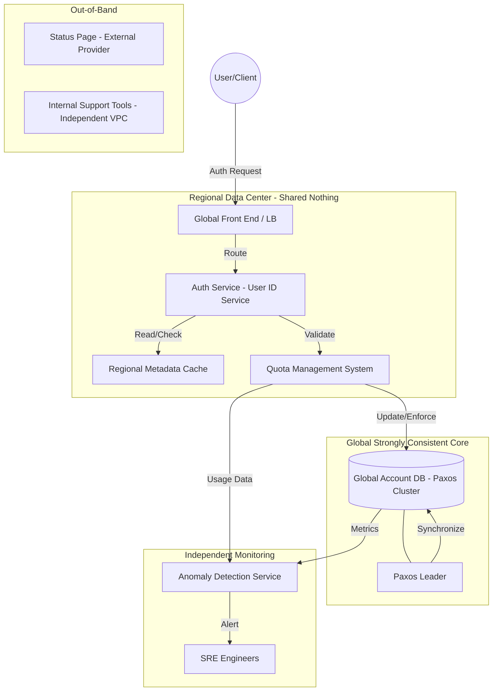

This High-Level Design (HLD) synthesizes the architectural lessons from the 2020 Google User ID Service outage and subsequent distributed systems failures (Cloudflare, DynamoDB) to outline a resilient Authentication System.

# High-Level Design: Google Gmail Auth System

## 1. Architectural Overview

The system is designed as a globally distributed, strongly consistent identity provider. It prioritizes **Security and Consistency** over total availability—a "fail-closed" philosophy where the system rejects requests rather than risk authorizing users based on stale or incorrect data.

## 2. Core Components

### 2.1 User ID Service (The "Auth Service")
The primary entry point for authentication. It processes credentials, issues tokens (OAuth/OIDC), and resolves unique User IDs. It operates regionally but depends on the Global Control Plane for write-heavy account metadata changes.

### 2.2 Global Account Database (Paxos-based)
A distributed database using the **Paxos consensus algorithm** to ensure strong consistency. This is the source of truth for account state.
*   **Paxos Leader:** Handles all writes to ensure serializability. If the leader cannot write (e.g., due to quota errors), the entire auth pipeline for those users stalls to prevent security breaches.

### 2.3 Quota Management System (QMS)
A critical subsystem that tracks resource usage per service. As seen in the 2020 incident, this system acts as a "gatekeeper." 
*   **Role:** Prevents any single service from overwhelming the Account DB.
*   **Failure Vector:** If the QMS incorrectly reports usage as zero or fails to update, it can trigger a "Limit Exceeded" error on the DB, preventing the Paxos leader from committing new state.

### 2.4 Regional Metadata Cache
To reduce latency and dependency on the global leader, regional instances cache public keys and non-sensitive user metadata. However, for security-critical auth lookups, the system is designed to **reject** requests if the cached data is detected as too old (stale).

## 3. Scalability & Resilience Analysis

### 3.1 Scalability: Sharding and Federation
*   **User Sharding:** The Account DB is sharded by User ID ranges. This limits the "blast radius" of a database failure to a specific subset of users rather than the entire global population.
*   **Read-heavy Optimization:** Auth is 99% reads. Distributed read-replicas allow for high throughput, though they must heartbeat back to the Paxos leader to verify data freshness.

### 3.2 Availability: The "Fail-Closed" Trade-off
The system follows a strict **Consistency over Availability (CP)** model under the CAP theorem. 
*   **Resilience through Outdated Data Rejection:** For security reasons, if a regional service cannot verify that its data is current (e.g., synchronization with the Paxos leader is broken), it will return a 5xx error. 
*   **Lesson:** Stale data in auth could mean allowing a deleted or compromised account access; thus, downtime is preferred over a security lapse.

### 3.3 Durability: Multi-Region Paxos
By using Paxos across multiple geographically distant data centers, the system ensures that even if an entire region goes offline, the account data remains durable and the cluster can elect a new leader.

## 4. Key Takeaways & Trade-offs

### 4.1 Consistency vs. Resilience
We intentionally sacrifice availability when the "freshness" of data is in doubt. The 2020 outage proved that a failure in the **Quota System**—a secondary support system—can behave like a primary system failure if it blocks the DB write-path.

### 4.2 The "Blast Radius" of Migrations
*   **Trade-off:** We use "partial migrations" (running old and new quota systems concurrently) to avoid "big bang" failures. 
*   **Risk:** This creates a period of high complexity where two systems might disagree. The design now requires **Semantic Monitoring**—alerts that trigger not just on "System Down," but when a metric (like usage) drops to zero during a migration period.

### 4.3 Independent Emergency Systems
A major design requirement is the **Independence of Support Tools**. If the Auth system is down, engineers cannot log in to fix it using internal tools that require... Auth.
*   **Choice:** Emergency communication (Status Pages) and SRE access must reside on separate, "share-nothing" infrastructure (e.g., a different cloud provider or isolated network stack) to ensure visibility during a global auth blackout.

### 4.4 Defensive Coding in Proxy Layers
Following the Cloudflare 2025 lesson, the Bot Management and Auth proxy modules must implement **Safe Ingestion**. If a configuration or "feature file" (like a quota map) exceeds pre-allocated memory limits, the system should log an error and use the **last known good configuration** rather than unwrap an error and panic the process.