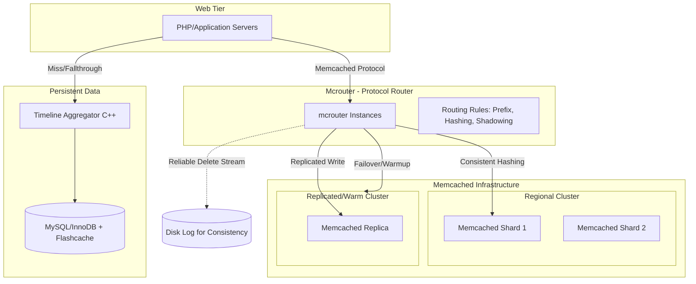

This report synthesizes technical insights from Facebook’s Engineering blog posts regarding their distributed caching infrastructure, specifically focusing on **mcrouter** and the evolution of **Memcached** to handle the social graph at a scale of billions of requests per second.

---

### 1. High-Level Architecture Diagram

The following diagram illustrates the request flow from the application tier through the routing layer to the heterogeneous storage/cache tiers.

---

### 2. Component Breakdown

#### **A. mcrouter (The Control Plane)**
Mcrouter is the lynchpin of the architecture. It acts as a transparent proxy between the application and the cache servers.
*   **Protocol Support:** Uses standard ASCII Memcached protocol, allowing it to be "dropped in" without client code changes.
*   **Routing Logic:** Uses "Route Handles" to compose complex logic (e.g., `AllSyncRoute`, `FailoverRoute`).
*   **Prefix Routing:** Routes keys based on prefixes (e.g., `user_id:` goes to one pool, `photo_id:` to another).
*   **Connection Pooling:** Reduces the TCP connection overhead on individual Memcached servers by multiplexing requests from thousands of clients.

#### **B. Memcached Tier (The Data Plane)**
Facebook treats Memcached as a massive, distributed hash table for the social graph.
*   **Sharding:** Keys are distributed via consistent hashing (`furc_hash`).
*   **Replication:** For hot keys or high-availability requirements, pools are replicated so reads can be fanned out across multiple replicas to avoid packet-rate bottlenecks on a single NIC.

#### **C. Timeline Aggregator & Storage**
For complex products like Timeline, the cache works in tandem with a specialized storage layer.
*   **Denormalization:** Data is moved from highly normalized MySQL tables to denormalized, IO-efficient rows to minimize random disk IO during cache misses.
*   **C++ Aggregator:** A service running locally on database boxes that performs ranking and filtering in C++ rather than PHP, reducing network transfer of irrelevant data.

#### **D. Consistency Mechanism (Reliable Delete Stream)**
To maintain consistency in a demand-filled look-aside cache:
*   Mcrouter logs delete commands to disk if the destination is unreachable.
*   A background process replays these deletes, ensuring that stale data is eventually invalidated even during network partitions.

---

### 3. Scalability Analysis

#### **The "Fan-Out" Challenge**
Facebook’s social graph is highly interconnected. A single page load can trigger hundreds of Memcached requests (fan-out). If these requests were synchronous and sequential, latency would be untenable. mcrouter manages this by fanning out requests asynchronously across thousands of servers.

#### **Handling Hot Spots (Fan-In)**
Specific objects (e.g., a celebrity's post) create "fan-in" issues where a single Memcached node is overwhelmed. Facebook mitigates this via:
1.  **Replicated Pools:** Spreading the read load of the same key across multiple hosts.
2.  **Quality of Service (QoS):** Throttling request rates per-pool or per-host to prevent cascading failures.

#### **Cold Cache Warmup**
When a new cache cluster is brought online, it is "cold" (empty). A sudden surge of misses would crash the underlying database. Mcrouter solves this by automatically refilling the "cold" cache from a designated "warm" cluster before the request reaches the DB.

#### **Infrastructure Evolution**
*   **Hardware Efficiency:** Use of `jemalloc` for memory allocation and `Flashcache` (kernel driver) to extend the database's buffer pool onto flash storage.
*   **Denormalization for IO:** By clustering data by `(user, time)` on disk, the system converts hundreds of random IO seeks into a few efficient range scans.

---

### 4. Key Takeaways for System Design

1.  **Decouple Routing from Application:** By using a proxy (mcrouter), you can change sharding logic, failover strategies, and hardware pools without redeploying the application tier.
2.  **Optimize for Random IO:** In massive systems, the bottleneck is often random disk IO. Denormalizing data to support "streaming" reads from disk is a primary scaling strategy for persistent storage.
3.  **Shadow Testing is Essential:** mcrouter's "Shadowing" feature allows production traffic to be mirrored to a test cluster. This is the only way to accurately predict how new hardware or software will behave under a 5-billion-request-per-second load.
4.  **Async/Fibers for Concurrency:** Mcrouter’s use of lightweight threads (Fibers) allows it to handle high-concurrency networking without the overhead of heavy OS context switching.
5.  **Eventually Consistent Invalidation:** Ensuring deletes are delivered (even via disk-logging and retries) is more critical for user experience than absolute immediate consistency in a social graph context.