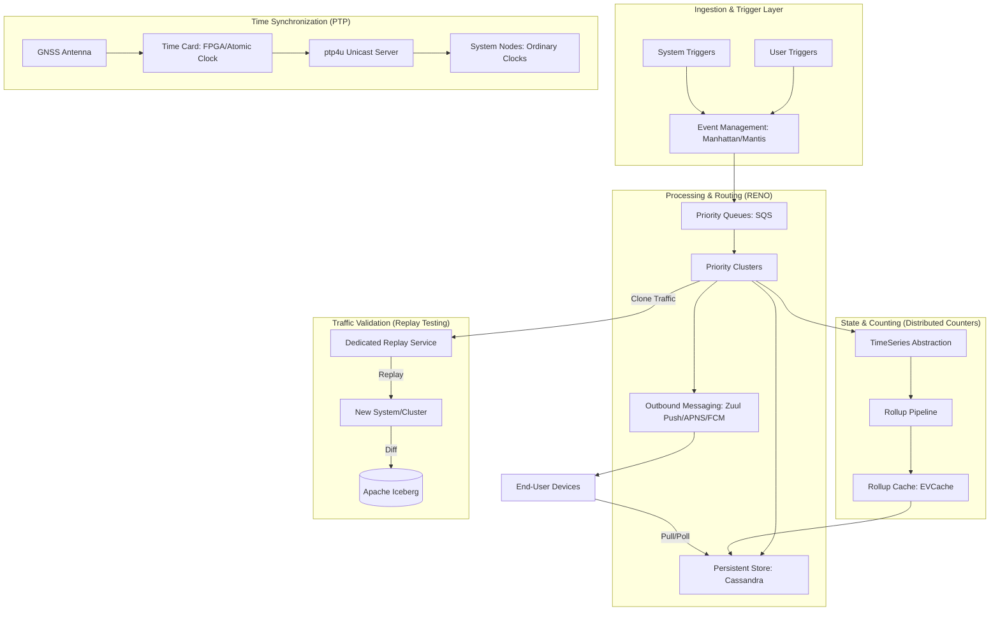

# High-Level Design: System Design

This document outlines the **Unified Event-Driven Infrastructure Platform** (referred to as **System Design**), synthesizing high-scale patterns for rapid notifications, nanosecond-precision timing, distributed counting, and risk-managed traffic migration as practiced at organizations like Netflix and Meta.

---

## 1. Architecture

### 1.1 Goals and Constraints
*   **High Throughput:** Handle 150k+ events/sec at peak.
*   **Near Real-Time Latency:** Deliver notifications and state updates across heterogeneous devices (Mobile, Smart TVs, Web) with minimal delay.
*   **Linearizable Consistency:** Provide nanosecond-precision time synchronization for distributed transaction ordering.
*   **Zero-Downtime Migration:** Enable validation of new architectures via production traffic shadowing.

### 1.2 Mermaid Diagram: Unified Data Flow

---

## 2. Core Components

### 2.1 Rapid Event Notification (RENO)
*   **Responsibility:** Orchestrates server-initiated communication.
*   **Interfaces:** Hybrid Push (immediate) and Pull (lifecycle-based) models.
*   **Scaling:** Sharded by event priority and member ID to prevent "thundering herd" issues.
*   **Failure Behavior:** Implements **Bulkheaded Delivery**. If APNS (Apple) is latent, it does not block FCM (Android) or Zuul Push (Web/TV) delivery.

### 2.2 Precision Time Protocol (PTP) Infrastructure
*   **Responsibility:** Replaces NTP to provide nanosecond-level clock synchronization across the fleet.
*   **Interfaces:** `ptp4u` (Unicast PTP server) and `fbclock` API.
*   **State Model:** Leverages a **Window of Uncertainty (WOU)**. Transactions are blocked until the `read_timestamp + WOU` to guarantee linearizability without expensive quorums.
*   **Recovery:** Nodes enter "Holdover Mode" using local atomic clocks if GNSS signal is lost.

### 2.3 Distributed Counter Abstraction
*   **Responsibility:** Scalable counting (e.g., A/B test facets, view counts).
*   **Scaling Model:** 
    *   **Best-Effort:** Regional EVCache (Memcached-based) for low-latency, non-critical counts.
    *   **Eventually Consistent:** Global event log with a **Rollup Pipeline** that aggregates events in background batches to avoid Cassandra wide partitions.
*   **Interfaces:** `AddCount(delta, idempotency_token)`, `GetCount()`.

### 2.4 Dedicated Replay Service
*   **Responsibility:** Validates functional correctness of new services using production traffic.
*   **Interfaces:** Asynchronous capture via Mantis stream processing.
*   **Recovery:** Decoupled from the critical path. Failure in the replay service has zero impact on the member experience.

---

## 3. Scalability, Reliability, Durability

### 3.1 Scaling Strategy
*   **Aggressive Scale-Up:** Processing clusters (RENO/Rollup) use scaling policies that favor rapid expansion over gradual contraction to handle sudden traffic spikes.
*   **Indirection via Manhattan:** A single source of events allows sharding traffic into priority-specific SQS queues, isolating critical "Maturity Level" changes from "Diagnostic Signals."

### 3.2 Reliability & Fault Tolerance
*   **Event Age Filter:** Stale events (older than a configurable threshold) are weeded out early to protect downstream services from flooded queues.
*   **Online Registry:** Zuul maintains a real-time registry of "Always-on" persistent connections, ensuring RENO only attempts push notifications to reachable devices.

### 3.3 Durability Trade-offs
*   **Event Sourcing:** Every state change is stored as an immutable event. The current state is an **Aggregate** of these events, allowing for point-in-time "Time Travel" debugging and auditability.

---

## 4. Trade-offs

| Feature | Chosen Approach | Alternative Considered | Trade-off Rationale |
| :--- | :--- | :--- | :--- |
| **Time Sync** | PTP (Unicast) | NTP or Boundary Clocks | Boundary clocks increased network complexity; Unicast PTP with Transparent Clocks (TC) reduced asymmetry errors. |
| **Counting** | Event Log + Rollup | Single-Row CAS Updates | Single-row updates cause heavy contention (hot keys). Rollups provide eventual consistency with high write-throughput. |
| **Validation** | Dedicated Replay Service | Device-Driven Replay | Device-driven replay wastes mobile resources and delays release cycles; dedicated service is decoupled and safer. |
| **Communication** | Hybrid Push/Pull | Push-Only | Push-only fails for Smart TVs (offline when not in use). Hybrid ensures consistency across all app lifecycles. |

---

## 5. Key Takeaways

*   **Linearizability at Scale:** In modern distributed systems, millisecond precision (NTP) is insufficient. PTP enables high-performance commit-wait protocols that save compute power by avoiding quorums.
*   **Isolation via Indirection:** Use an event management engine (Manhattan/Mantis) as a buffer. This allows for deduplication, staleness filtering, and priority sharding before hitting critical processing clusters.
*   **Shadowing for Confidence:** Moving traffic between microservices requires **Comparative Analysis**. Normalizing timestamps and using "Lineage" (dependency version tracking) are essential to filter noise in replay testing diffs.
*   **Idempotency is Non-Negotiable:** For both event sourcing and distributed counters, an `idempotency_token` is required to allow safe retries/hedging in unreliable networks.